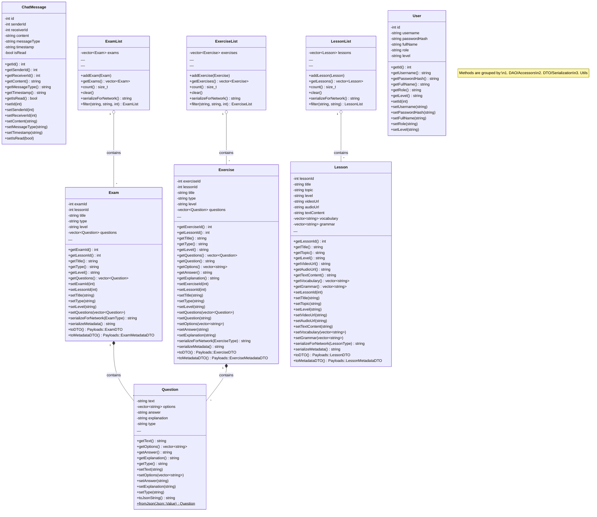

```mermaid
classDiagram
    note "Methods are grouped by:\n1. DAO/Accessors\n2. DTO/Serialization\n3. Utils"

    class ChatMessage {
        -int id
        -int senderId
        -int receiverId
        -string content
        -string messageType
        -string timestamp
        -bool isRead
        +getId() int
        +getSenderId() int
        +getReceiverId() int
        +getContent() string
        +getMessageType() string
        +getTimestamp() string
        +getIsRead() bool
        +setId(int)
        +setSenderId(int)
        +setReceiverId(int)
        +setContent(string)
        +setMessageType(string)
        +setTimestamp(string)
        +setIsRead(bool)
    }

    class Question {
        -string text
        -vector~string~ options
        -string answer
        -string explanation
        -string type
        +getText() string
        +getOptions() vector~string~
        +getAnswer() string
        +getExplanation() string
        +getType() string
        +setText(string)
        +setOptions(vector~string~)
        +setAnswer(string)
        +setExplanation(string)
        +setType(string)
        __
        +toJsonString() string
        +fromJson(Json::Value) Question$
    }

    class Exam {
        -int examId
        -int lessonId
        -string title
        -string type
        -string level
        -vector~Question~ questions
        +getExamId() int
        +getLessonId() int
        +getTitle() string
        +getType() string
        +getLevel() string
        +getQuestions() vector~Question~
        +setExamId(int)
        +setLessonId(int)
        +setTitle(string)
        +setType(string)
        +setLevel(string)
        +setQuestions(vector~Question~)
        __
        +serializeForNetwork(ExamType) string
        +serializeMetadata() string
        +toDTO() Payloads::ExamDTO
        +toMetadataDTO() Payloads::ExamMetadataDTO
    }

    class ExamList {
        -vector~Exam~ exams
        +addExam(Exam)
        +getExams() vector~Exam~
        +count() size_t
        +clear()
        __
        +serializeForNetwork() string
        __
        +filter(string, string, int) ExamList
    }

    class Exercise {
        -int exerciseId
        -int lessonId
        -string title
        -string type
        -string level
        -vector~Question~ questions
        +getExerciseId() int
        +getLessonId() int
        +getTitle() string
        +getType() string
        +getLevel() string
        +getQuestions() vector~Question~
        +getQuestion() string
        +getOptions() vector~string~
        +getAnswer() string
        +getExplanation() string
        +setExerciseId(int)
        +setLessonId(int)
        +setTitle(string)
        +setType(string)
        +setLevel(string)
        +setQuestions(vector~Question~)
        +setQuestion(string)
        +setOptions(vector~string~)
        +setAnswer(string)
        +setExplanation(string)
        __
        +serializeForNetwork(ExerciseType) string
        +serializeMetadata() string
        +toDTO() Payloads::ExerciseDTO
        +toMetadataDTO() Payloads::ExerciseMetadataDTO
    }

    class ExerciseList {
        -vector~Exercise~ exercises
        +addExercise(Exercise)
        +getExercises() vector~Exercise~
        +count() size_t
        +clear()
        __
        +serializeForNetwork() string
        __
        +filter(string, string, int) ExerciseList
    }

    class Lesson {
        -int lessonId
        -string title
        -string topic
        -string level
        -string videoUrl
        -string audioUrl
        -string textContent
        -vector~string~ vocabulary
        -vector~string~ grammar
        +getLessonId() int
        +getTitle() string
        +getTopic() string
        +getLevel() string
        +getVideoUrl() string
        +getAudioUrl() string
        +getTextContent() string
        +getVocabulary() vector~string~
        +getGrammar() vector~string~
        +setLessonId(int)
        +setTitle(string)
        +setTopic(string)
        +setLevel(string)
        +setVideoUrl(string)
        +setAudioUrl(string)
        +setTextContent(string)
        +setVocabulary(vector~string~)
        +setGrammar(vector~string~)
        __
        +serializeForNetwork(LessonType) string
        +serializeMetadata() string
        +toDTO() Payloads::LessonDTO
        +toMetadataDTO() Payloads::LessonMetadataDTO
    }

    class LessonList {
        -vector~Lesson~ lessons
        +addLesson(Lesson)
        +getLessons() vector~Lesson~
        +count() size_t
        +clear()
        __
        +serializeForNetwork() string
        __
        +filter(string, string) LessonList
    }

    class User {
        -int id
        -string username
        -string passwordHash
        -string fullName
        -string role
        -string level
        +getId() int
        +getUsername() string
        +getPasswordHash() string
        +getFullName() string
        +getRole() string
        +getLevel() string
        +setId(int)
        +setUsername(string)
        +setPasswordHash(string)
        +setFullName(string)
        +setRole(string)
        +setLevel(string)
    }

    Exam "1" *-- "*" Question : contains
    Exercise "1" *-- "*" Question : contains
    ExamList "1" o-- "*" Exam : contains
    ExerciseList "1" o-- "*" Exercise : contains
    LessonList "1" o-- "*" Lesson : contains
```
