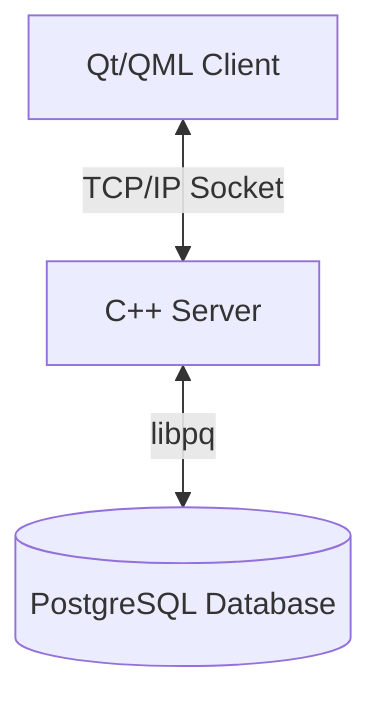

# Architecture Overview

## System Overview
The Socker Learning Platform is a client-server application designed for language learning. It uses a custom TCP-based binary protocol for efficient communication between a C++ server and a Qt/QML client.

## High-Level Architecture

### Key Components

1.  **Client (Qt/QML)**
    -   **UI Layer**: QML for a fluid, modern, and responsive user interface.
    -   **Logic Layer**: C++ `NetworkManager` and `NetworkClient` handle communication and business logic.
    -   **Pattern**: Model-View-Controller (MVC) adaptation where QML is the View, C++ models are the Model, and `NetworkManager` acts as the Controller.

2.  **Server (C++)**
    -   **Core**: Single-threaded Event Loop using `select()` for non-blocking I/O.
    -   **Architecture**: Layered architecture (Controller-Service-Repository).
    -   **Data Access**: Repository pattern to abstract PostgreSQL interactions.

3.  **Database (PostgreSQL)**
    -   Relational database storing users, content (lessons, exercises), and progress (results, chat).

## Design Decisions & Rationale

### Why C++ & Qt?
-   **Performance**: C++ offers high performance and low latency, crucial for real-time features like chat.
-   **Cross-Platform**: Qt allows the client to run on Linux, Windows, and macOS with a single codebase.
-   **Control**: Direct memory and socket management provides deep understanding and fine-grained control over resources.

### Why Custom TCP Protocol?
-   **Efficiency**: Binary protocol minimizes overhead compared to text-based protocols like HTTP/JSON.
-   **Stateful Connection**: Persistent TCP connection is ideal for real-time features (chat, notifications) without polling overhead (though polling is currently used for simplicity in some areas).
-   **Learning**: Building a custom protocol demonstrates core networking concepts.

### Why Repository Pattern?
-   **Abstraction**: Decouples business logic (Controllers) from data access details (SQL queries).
-   **Testability**: Makes it easier to mock database interactions for unit testing.
-   **Maintainability**: SQL queries are centralized, making schema changes easier to manage.

### Why Event Loop (Server)?
-   **Scalability**: Handles multiple clients on a single thread without the overhead of context switching found in thread-per-client models.
-   **Simplicity**: Avoids complex synchronization issues (mutexes, locks) associated with multi-threaded shared state.
