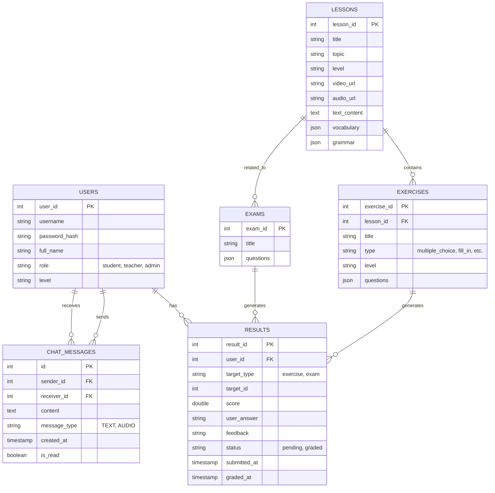

# Database Schema

## Overview
The Socker Learning Platform uses a PostgreSQL database to store user data, learning content, and progress. The schema is designed to be normalized and relational.

## Entity-Relationship Diagram

## Tables Description

### 1. Users
Stores account information for all users.
-   **role**: Determines access permissions (RBAC).
-   **level**: Current proficiency level (e.g., A1, B2).

### 2. Lessons
Core learning content.
-   **vocabulary/grammar**: Stored as JSON arrays for flexibility.
-   **media**: URLs to video/audio resources.

### 3. Exercises
Practice material linked to lessons.
-   **questions**: Stored as JSON to support various question types (Multiple Choice, Fill-in-the-blank, etc.) without complex join tables.

### 4. Exams
Assessments not necessarily tied to a single lesson.
-   **questions**: JSON structure similar to exercises.

### 5. Results
Tracks student progress and submissions.
-   **Polymorphic Association**: Links to either `Exercise` or `Exam` via `target_type` and `target_id`.
-   **status**: Used for teacher grading workflow ('pending' -> 'graded').

### 6. ChatMessages
Stores communication history.
-   **message_type**: Supports text and audio messages (base64 encoded or file paths).

## Design Rationale

### JSON Columns
We use `JSONB` (or `JSON`) columns for `questions`, `vocabulary`, and `grammar`.
-   **Flexibility**: Allows different question structures (options vs text input) without changing the schema.
-   **Simplicity**: Fetches all related data in a single query, avoiding N+1 query problems.

### Polymorphic Results
Instead of separate `exam_results` and `exercise_results` tables, a single `results` table simplifies querying for a user's overall progress and "pending submissions" for teachers.
