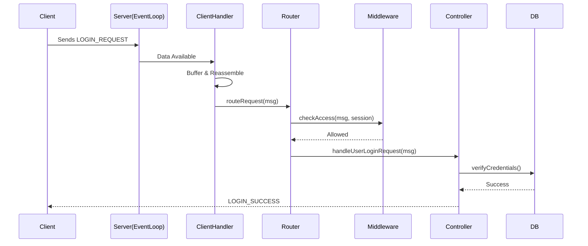

# Server Design

## Overview
The server is a high-performance, single-threaded C++ application that handles multiple client connections using non-blocking I/O and an event loop. It serves as the central hub for the Socker Learning Platform.

## Core Components

### 1. Server Class (`server.cpp`)
The entry point and main event loop.
-   **Socket Management**: Creates, binds, and listens on the TCP port.
-   **Event Loop**: Uses `select()` to monitor file descriptors (server socket + client sockets) for activity.
-   **Non-Blocking I/O**: All sockets are set to `O_NONBLOCK` to prevent the single thread from hanging on slow clients.

### 2. ClientHandler (`client_handler.cpp`)
Manages the lifecycle of client requests.
-   **Message Processing**: Reassembles fragmented TCP packets into complete `protocol::Message` objects.
-   **Dispatch**: Forwards complete messages to the `RequestRouter`.

### 3. RequestRouter (`request_router.cpp`)
Routes messages to the appropriate Controller based on `MsgCode`.
-   **Middleware Integration**: Applies `RBACMiddleware` before routing to ensure permissions.
-   **Routing Table**: Maps `MsgCode` (e.g., `LOGIN_REQUEST`) to Controller methods (e.g., `UserController::handleUserLoginRequest`).

### 4. Controllers
Implement business logic.
-   **UserController**: Auth, Profile.
-   **LessonController**: Content delivery.
-   **Exercise/ExamController**: Assessment logic.
-   **ResultController**: Grading and progress.
-   **ChatController**: Messaging.

### 5. Repositories
Abstract database access (see `database_schema.md`).

## Request Flow Example

## Concurrency Model
We chose a **Single-Threaded Event Loop** over Thread-Per-Client.

### Rationale
1.  **Simplicity**: No need for complex locking mechanisms (mutexes) for shared resources like the Chat history or Active User list.
2.  **Efficiency**: Threads consume stack memory and kernel resources. Context switching between thousands of threads is expensive. An event loop handles thousands of idle connections with minimal overhead.
3.  **Suitability**: The workload is primarily I/O bound (DB queries, Network), not CPU bound.

### Handling Blocking Operations
*Note: Currently, database operations are synchronous (blocking) via `libpq`. In a production environment with heavy load, this would be moved to a thread pool to avoid blocking the main event loop. For this project's scale, blocking DB calls are acceptable.*
