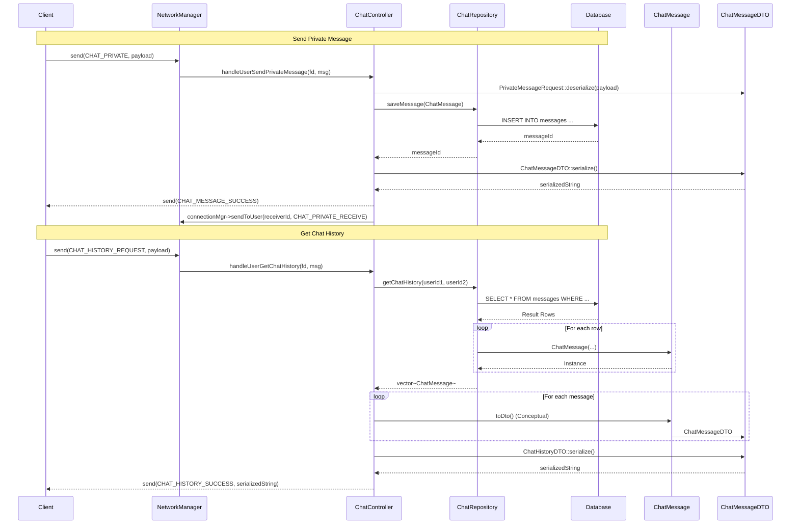

# ChatMessage Data Flow

```mermaid
sequenceDiagram
    participant Client
    participant Network as NetworkManager
    participant Controller as ChatController
    participant Repo as ChatRepository
    participant DB as Database
    participant Model as ChatMessage
    participant DTO as ChatMessageDTO

    Note over Client, DB: Send Private Message

    Client->>Network: send(CHAT_PRIVATE, payload)
    Network->>Controller: handleUserSendPrivateMessage(fd, msg)
    
    Controller->>DTO: PrivateMessageRequest::deserialize(payload)
    
    Controller->>Repo: saveMessage(ChatMessage)
    Repo->>DB: INSERT INTO messages ...
    DB-->>Repo: messageId
    Repo-->>Controller: messageId

    Controller->>DTO: ChatMessageDTO::serialize()
    DTO-->>Controller: serializedString

    Controller-->>Client: send(CHAT_MESSAGE_SUCCESS)
    Controller->>Network: connectionMgr->sendToUser(receiverId, CHAT_PRIVATE_RECEIVE)

    Note over Client, DB: Get Chat History

    Client->>Network: send(CHAT_HISTORY_REQUEST, payload)
    Network->>Controller: handleUserGetChatHistory(fd, msg)
    
    Controller->>Repo: getChatHistory(userId1, userId2)
    Repo->>DB: SELECT * FROM messages WHERE ...
    DB-->>Repo: Result Rows
    
    loop For each row
        Repo->>Model: ChatMessage(...)
        Model-->>Repo: Instance
    end
    Repo-->>Controller: vector~ChatMessage~

    loop For each message
        Controller->>Model: toDto() (Conceptual)
        Model->>DTO: ChatMessageDTO
    end

    Controller->>DTO: ChatHistoryDTO::serialize()
    DTO-->>Controller: serializedString
    Controller-->>Client: send(CHAT_HISTORY_SUCCESS, serializedString)
```
