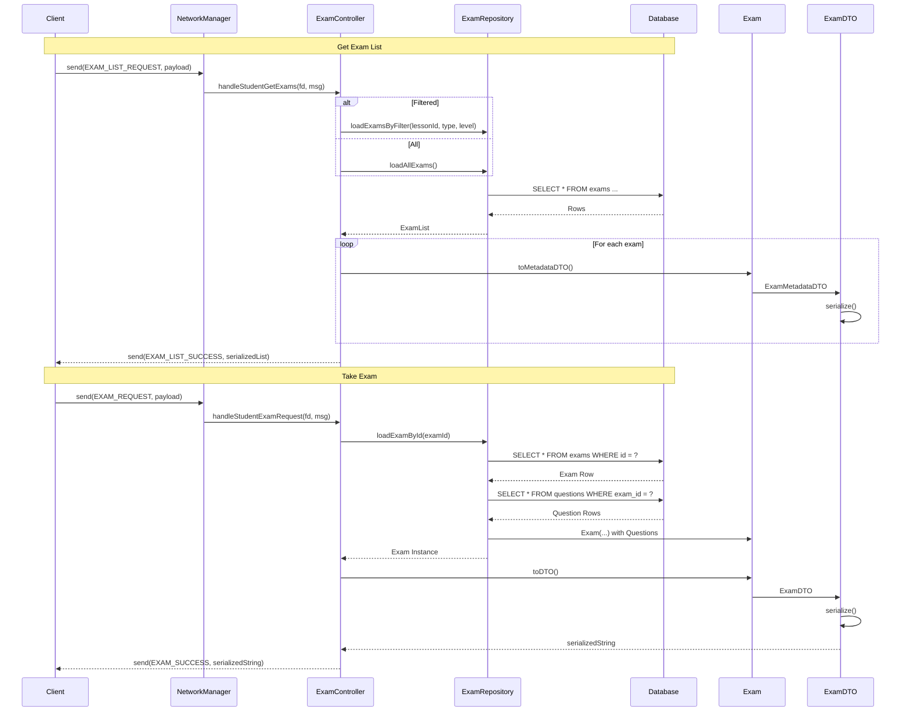

# Exam Data Flow

```mermaid
sequenceDiagram
    participant Client
    participant Network as NetworkManager
    participant Controller as ExamController
    participant Repo as ExamRepository
    participant DB as Database
    participant Model as Exam
    participant DTO as ExamDTO

    Note over Client, DB: Get Exam List

    Client->>Network: send(EXAM_LIST_REQUEST, payload)
    Network->>Controller: handleStudentGetExams(fd, msg)
    
    alt Filtered
        Controller->>Repo: loadExamsByFilter(lessonId, type, level)
    else All
        Controller->>Repo: loadAllExams()
    end

    Repo->>DB: SELECT * FROM exams ...
    DB-->>Repo: Rows
    Repo-->>Controller: ExamList

    loop For each exam
        Controller->>Model: toMetadataDTO()
        Model->>DTO: ExamMetadataDTO
        DTO->>DTO: serialize()
    end

    Controller-->>Client: send(EXAM_LIST_SUCCESS, serializedList)

    Note over Client, DB: Take Exam

    Client->>Network: send(EXAM_REQUEST, payload)
    Network->>Controller: handleStudentExamRequest(fd, msg)

    Controller->>Repo: loadExamById(examId)
    Repo->>DB: SELECT * FROM exams WHERE id = ?
    DB-->>Repo: Exam Row
    Repo->>DB: SELECT * FROM questions WHERE exam_id = ?
    DB-->>Repo: Question Rows
    
    Repo->>Model: Exam(...) with Questions
    Repo-->>Controller: Exam Instance

    Controller->>Model: toDTO()
    Model->>DTO: ExamDTO
    DTO->>DTO: serialize()
    DTO-->>Controller: serializedString

    Controller-->>Client: send(EXAM_SUCCESS, serializedString)
```
