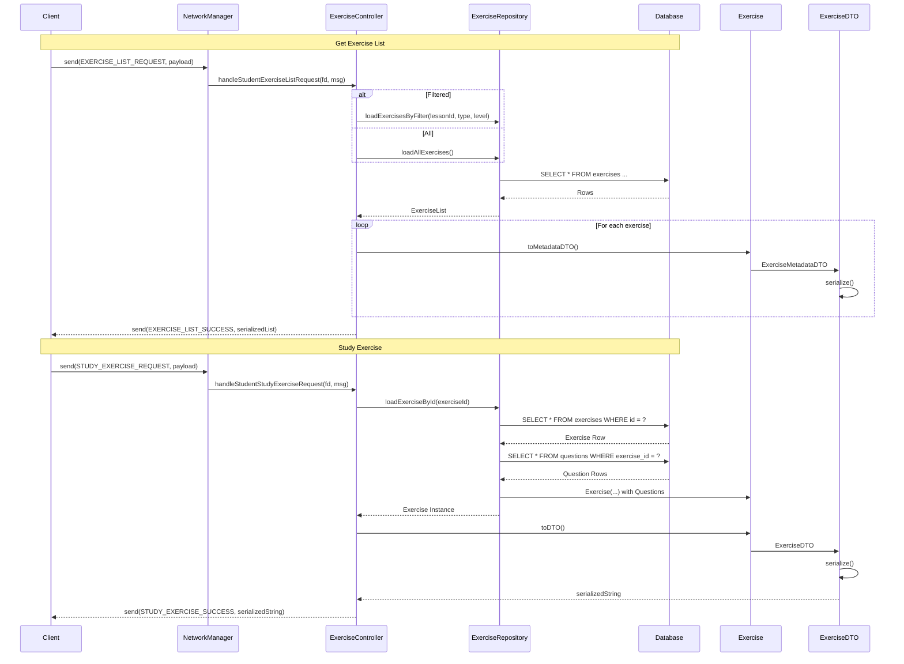

# Exercise Data Flow

```mermaid
sequenceDiagram
    participant Client
    participant Network as NetworkManager
    participant Controller as ExerciseController
    participant Repo as ExerciseRepository
    participant DB as Database
    participant Model as Exercise
    participant DTO as ExerciseDTO

    Note over Client, DB: Get Exercise List

    Client->>Network: send(EXERCISE_LIST_REQUEST, payload)
    Network->>Controller: handleStudentExerciseListRequest(fd, msg)
    
    alt Filtered
        Controller->>Repo: loadExercisesByFilter(lessonId, type, level)
    else All
        Controller->>Repo: loadAllExercises()
    end

    Repo->>DB: SELECT * FROM exercises ...
    DB-->>Repo: Rows
    Repo-->>Controller: ExerciseList

    loop For each exercise
        Controller->>Model: toMetadataDTO()
        Model->>DTO: ExerciseMetadataDTO
        DTO->>DTO: serialize()
    end

    Controller-->>Client: send(EXERCISE_LIST_SUCCESS, serializedList)

    Note over Client, DB: Study Exercise

    Client->>Network: send(STUDY_EXERCISE_REQUEST, payload)
    Network->>Controller: handleStudentStudyExerciseRequest(fd, msg)

    Controller->>Repo: loadExerciseById(exerciseId)
    Repo->>DB: SELECT * FROM exercises WHERE id = ?
    DB-->>Repo: Exercise Row
    Repo->>DB: SELECT * FROM questions WHERE exercise_id = ?
    DB-->>Repo: Question Rows
    
    Repo->>Model: Exercise(...) with Questions
    Repo-->>Controller: Exercise Instance

    Controller->>Model: toDTO()
    Model->>DTO: ExerciseDTO
    DTO->>DTO: serialize()
    DTO-->>Controller: serializedString

    Controller-->>Client: send(STUDY_EXERCISE_SUCCESS, serializedString)
```
