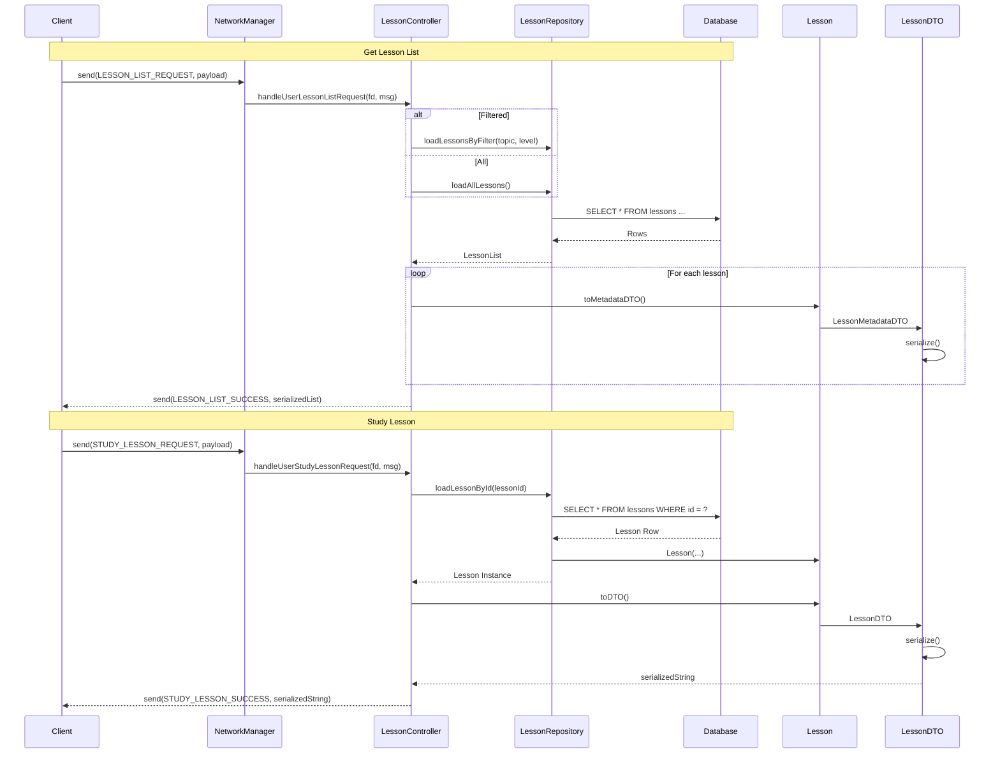

# Lesson Data Flow

```mermaid
sequenceDiagram
    participant Client
    participant Network as NetworkManager
    participant Controller as LessonController
    participant Repo as LessonRepository
    participant DB as Database
    participant Model as Lesson
    participant DTO as LessonDTO

    Note over Client, DB: Get Lesson List

    Client->>Network: send(LESSON_LIST_REQUEST, payload)
    Network->>Controller: handleUserLessonListRequest(fd, msg)
    
    alt Filtered
        Controller->>Repo: loadLessonsByFilter(topic, level)
    else All
        Controller->>Repo: loadAllLessons()
    end

    Repo->>DB: SELECT * FROM lessons ...
    DB-->>Repo: Rows
    Repo-->>Controller: LessonList

    loop For each lesson
        Controller->>Model: toMetadataDTO()
        Model->>DTO: LessonMetadataDTO
        DTO->>DTO: serialize()
    end

    Controller-->>Client: send(LESSON_LIST_SUCCESS, serializedList)

    Note over Client, DB: Study Lesson

    Client->>Network: send(STUDY_LESSON_REQUEST, payload)
    Network->>Controller: handleUserStudyLessonRequest(fd, msg)

    Controller->>Repo: loadLessonById(lessonId)
    Repo->>DB: SELECT * FROM lessons WHERE id = ?
    DB-->>Repo: Lesson Row
    
    Repo->>Model: Lesson(...)
    Repo-->>Controller: Lesson Instance

    Controller->>Model: toDTO()
    Model->>DTO: LessonDTO
    DTO->>DTO: serialize()
    DTO-->>Controller: serializedString

    Controller-->>Client: send(STUDY_LESSON_SUCCESS, serializedString)
```
